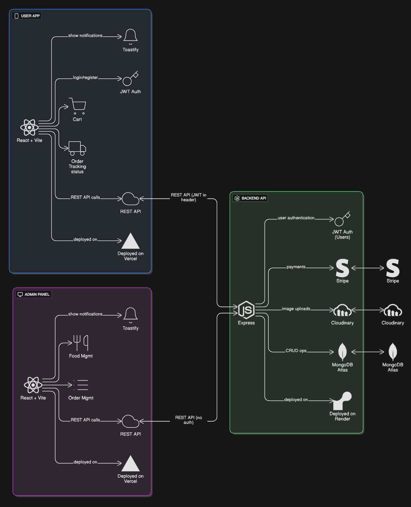

# Food Delivery App

## Architectural Diagram



A full-stack food delivery application with user and admin panels, built using React (Vite), Node.js (Express), MongoDB Atlas, Stripe, and Cloudinary.

---

## Table of Contents

- [Features](#features)
- [Architecture](#architecture)
- [Project Structure](#project-structure)
- [Setup & Installation](#setup--installation)
- [API Endpoints](#api-endpoints)
  - [User Endpoints](#user-endpoints)
  - [Food Endpoints](#food-endpoints)
  - [Cart Endpoints](#cart-endpoints)
  - [Order Endpoints](#order-endpoints)
- [Tech Stack](#tech-stack)
- [Deployment](#deployment)
- [License](#license)

---

## Features

- User authentication (JWT)
- Browse, filter, and order food items
- Cart management
- Stripe payment integration
- Order tracking
- Admin panel for food and order management
- Image uploads via Cloudinary

---

## Architecture

- **Frontend (User App):** React + Vite, Toastify for notifications, JWT Auth, REST API calls, deployed on Vercel
- **Admin Panel:** React + Vite, Toastify, REST API calls, deployed on Vercel
- **Backend API:** Node.js + Express, JWT Auth, Stripe payments, Cloudinary uploads, MongoDB Atlas, deployed on Render

See the diagram above for details.

---

## Project Structure

```
.
├── backend
│   ├── config
│   ├── controllers
│   ├── middleware
│   ├── models
│   ├── routes
│   ├── .env
│   ├── package.json
│   └── server.js
├── frontend
│   ├── public
│   ├── src
│   ├── .env
│   ├── package.json
│   └── vite.config.js
├── admin
│   ├── public
│   ├── src
│   ├── .env
│   ├── package.json
│   └── vite.config.js
└── README.md
```

---

## Setup & Installation

1. **Clone the repository**
2. **Install dependencies** in each folder (`npm install`)
3. **Configure environment variables** in `backend/.env`
4. **Start backend**: `npm run server` (from `backend/`)
5. **Start frontend/admin**: `npm run dev` (from `frontend/` or `admin/`)

---

## API Endpoints

### User Endpoints

- `POST /api/user/register`  
  Register a new user  
  **Body:** `{ name, email, password }`

- `POST /api/user/login`  
  Login user  
  **Body:** `{ email, password }`  
  **Response:** `{ success, token }`

### Food Endpoints

- `POST /api/food/add`  
  Add new food item (admin, multipart/form-data)  
  **Body:** `{ name, description, price, category, image }`

- `GET /api/food/list`  
  Get all food items

- `POST /api/food/remove`  
  Remove food item (admin)  
  **Body:** `{ id }`

### Cart Endpoints

- `POST /api/cart/add`  
  Add item to cart  
  **Headers:** `{ token }`  
  **Body:** `{ itemId }`

- `POST /api/cart/remove`  
  Remove item from cart  
  **Headers:** `{ token }`  
  **Body:** `{ itemId }`

- `POST /api/cart/get`  
  Get user's cart  
  **Headers:** `{ token }`

### Order Endpoints

- `POST /api/order/place`  
  Place an order  
  **Headers:** `{ token }`  
  **Body:** `{ address, items, amount }`  
  **Response:** `{ session_url }` (Stripe checkout)

- `POST /api/order/verify`  
  Verify payment  
  **Body:** `{ success, orderId }`

- `POST /api/order/userorders`  
  Get user's orders  
  **Headers:** `{ token }`

- `GET /api/order/list`  
  Get all orders (admin)

- `POST /api/order/status`  
  Update order status (admin)  
  **Body:** `{ orderId, status }`

---

## Tech Stack

- **Frontend:** React, Vite, Toastify, Axios, React Router
- **Backend:** Node.js, Express, Mongoose, JWT, Stripe, Cloudinary, Multer
- **Database:** MongoDB Atlas
- **Deployment:** Vercel (frontend/admin), Render (backend)

---

## Deployment

- **Frontend:** Vercel
- **Admin Panel:** Vercel
- **Backend:** Render
- **Database:** MongoDB Atlas
- **Image Hosting:** Cloudinary
- **Payments:** Stripe

---

## License

MIT License. See `LICENSE` for details.
